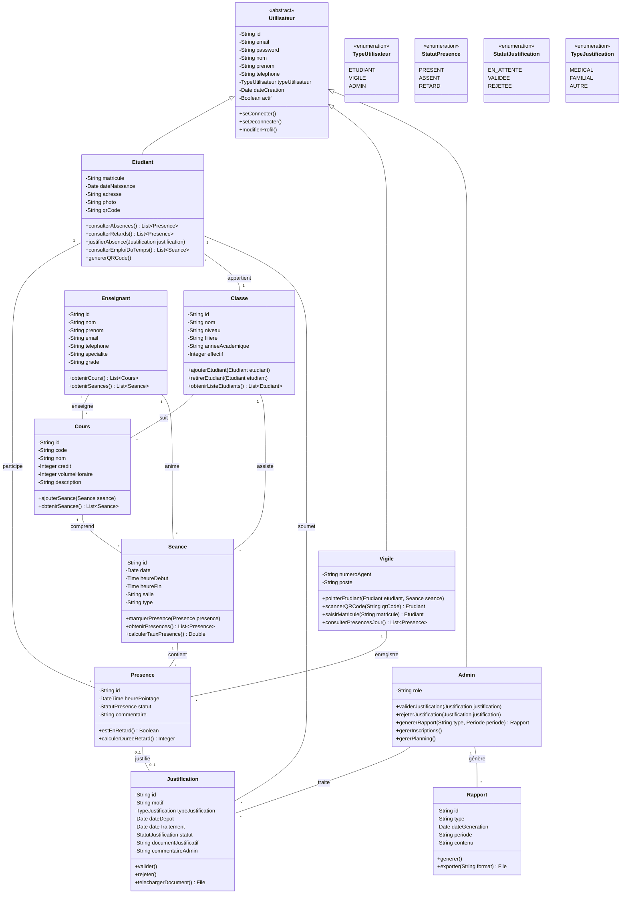
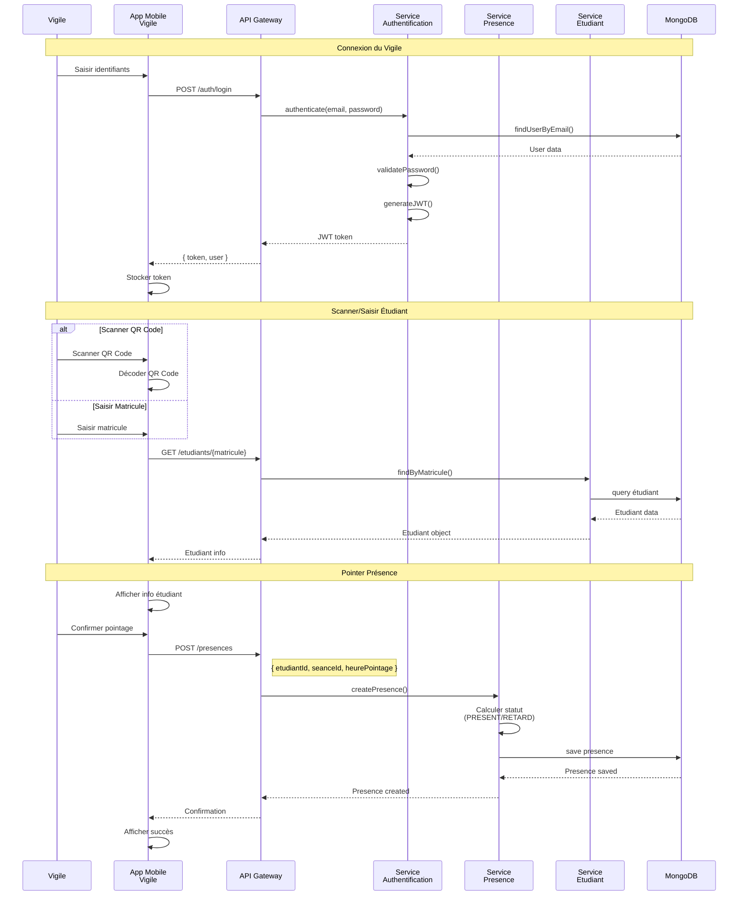
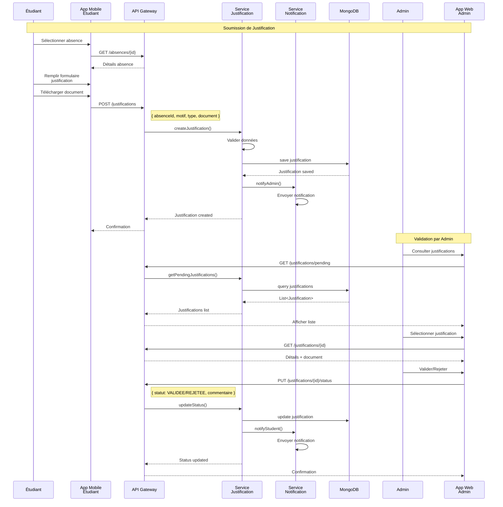

## 5. Diagramme d'Activités - Processus Global de Gestion des Absences

```mermaid
flowchart TD
    Start([Début de séance]) --> Fork1{" "}
    
    Fork1 --> VLogin[Vigile se connecte]
    Fork1 --> EArrive[Étudiants arrivent]
    
    VLogin --> VAccess[Vigile accède à la séance]
    VAccess --> Fork1End{" "}
    EArrive --> Fork1End
    
    Fork1End --> StartPointing[Vigile commence le pointage]
    
    StartPointing --> CheckMore{Étudiants à pointer?}
    
    CheckMore -->|Oui| MethodChoice{Méthode de pointage?}
    CheckMore -->|Non| EndPointing[Fin du pointage]
    
    MethodChoice -->|QR Code| ScanQR[Scanner QR Code]
    MethodChoice -->|Matricule| EnterMat[Saisir matricule]
    
    ScanQR --> VerifyStudent[Vérifier identité étudiant]
    EnterMat --> VerifyStudent
    
    VerifyStudent --> CalcTime[Calculer heure d'arrivée]
    
    CalcTime --> CheckTime{Heure ≤ Début + 15min?}
    
    CheckTime -->|Oui| MarkPresent[Marquer PRESENT]
    CheckTime -->|Non| MarkLate[Marquer RETARD]
    
    MarkPresent --> SavePresence[Enregistrer présence]
    MarkLate --> SavePresence
    
    SavePresence --> CheckMore
    
    EndPointing --> Fork2{" "}
    
    Fork2 --> GenAbsent[Génération liste absents]
    Fork2 --> UpdateStats[Mise à jour statistiques]
    
    GenAbsent --> NotifyAbsent[Notification aux absents]
    UpdateStats --> Fork2End{" "}
    NotifyAbsent --> Fork2End
    
    Fork2End --> StudentProcess[Processus Étudiant]
    
    subgraph "Processus Étudiant"
        StudentProcess --> ConsultAbs[Étudiant consulte absences]
        ConsultAbs --> HasJustify{Absence à justifier?}
        
        HasJustify -->|Non| EndStudent[Fin processus étudiant]
        HasJustify -->|Oui| FillJustif[Remplir justification]
        
        FillJustif --> UploadDoc[Télécharger document]
        UploadDoc --> SubmitJustif[Soumettre justification]
        
        subgraph "Processus Admin"
            SubmitJustif --> AdminNotif[Admin reçoit notification]
            AdminNotif --> ExamineJustif[Admin examine justification]
            
            ExamineJustif --> ValidJustif{Justification valide?}
            
            ValidJustif -->|Oui| Validate[Valider justification]
            ValidJustif -->|Non| Reject[Rejeter justification]
            
            Validate --> UpdateStatus[Mettre à jour statut absence]
            Reject --> AddComment[Ajouter commentaire]
            
            UpdateStatus --> NotifyStudent[Notifier étudiant]
            AddComment --> NotifyStudent
        end
        
        NotifyStudent --> EndStudent
    end
    
    EndStudent --> EndProcess([Fin du processus])
    
    %% Styles pour améliorer la lisibilité
    classDef startEnd fill:#e1f5fe,stroke:#01579b,stroke-width:3px
    classDef process fill:#fff3e0,stroke:#e65100,stroke-width:2px
    classDef decision fill:#f3e5f5,stroke:#4a148c,stroke-width:2px
    classDef fork fill:#e8f5e9,stroke:#1b5e20,stroke-width:2px
    
    class Start,EndProcess startEnd
    class VLogin,VAccess,EArrive,StartPointing,ScanQR,EnterMat,VerifyStudent,CalcTime,MarkPresent,MarkLate,SavePresence,EndPointing,GenAbsent,NotifyAbsent,UpdateStats,StudentProcess,ConsultAbs,FillJustif,UploadDoc,SubmitJustif,AdminNotif,ExamineJustif,Validate,Reject,UpdateStatus,AddComment,NotifyStudent,EndStudent process
    class CheckMore,MethodChoice,CheckTime,HasJustify,ValidJustif decision
    class Fork1,Fork1End,Fork2,Fork2End fork
```# Modélisation UML - Système de Gestion des Absences ISM

## 1. Diagramme de Cas d'Utilisation (Use Case)

```mermaid
graph TB
    subgraph "Acteurs"
        Vigile[fa:fa-user-shield Vigile]
        Etudiant[fa:fa-graduation-cap Étudiant]
        Admin[fa:fa-user-cog Administrateur]
    end
    
    subgraph "Système de Gestion des Absences ISM"
        %% Cas d'utilisation communs
        Login[Se connecter]
        
        %% Cas d'utilisation Vigile
        ScanQR[Scanner QR Code étudiant]
        SaisirMat[Saisir matricule étudiant]
        Pointer[Pointer un étudiant]
        ConsulterPresJour[Consulter présences du jour]
        
        %% Cas d'utilisation Étudiant
        ConsulterAbs[Consulter ses absences]
        ConsulterRet[Consulter ses retards]
        Justifier[Justifier absence/retard]
        ConsulterEDT[Consulter emploi du temps]
        TelechargerJust[Télécharger justificatif]
        
        %% Cas d'utilisation Administrateur
        ConsulterToutesAbs[Consulter toutes absences]
        ConsulterTousRet[Consulter tous retards]
        ValiderJust[Valider justification]
        RejeterJust[Rejeter justification]
        GererInsc[Gérer inscriptions]
        GererClasses[Gérer classes]
        GererEns[Gérer enseignants]
        GererCours[Gérer cours]
        GererSeances[Gérer séances]
        GererPlanning[Gérer planning global]
        GenererRapports[Générer rapports]
    end
    
    %% Relations Vigile
    Vigile --> Login
    Vigile --> ScanQR
    Vigile --> SaisirMat
    Vigile --> Pointer
    Vigile --> ConsulterPresJour
    
    %% Relations Étudiant
    Etudiant --> Login
    Etudiant --> ConsulterAbs
    Etudiant --> ConsulterRet
    Etudiant --> Justifier
    Etudiant --> ConsulterEDT
    
    %% Relations Administrateur
    Admin --> Login
    Admin --> ConsulterToutesAbs
    Admin --> ConsulterTousRet
    Admin --> ValiderJust
    Admin --> RejeterJust
    Admin --> GererInsc
    Admin --> GererClasses
    Admin --> GererEns
    Admin --> GererCours
    Admin --> GererSeances
    Admin --> GererPlanning
    Admin --> GenererRapports
    
    %% Relations include/extend
    Pointer -.include.-> ScanQR
    Pointer -.include.-> SaisirMat
    Justifier -.extend.-> TelechargerJust
    
    %% Styles
    classDef actorStyle fill:#e1f5fe,stroke:#01579b,stroke-width:2px
    classDef usecaseStyle fill:#fff3e0,stroke:#e65100,stroke-width:2px
    
    class Vigile,Etudiant,Admin actorStyle
    class Login,ScanQR,SaisirMat,Pointer,ConsulterPresJour,ConsulterAbs,ConsulterRet,Justifier,ConsulterEDT,TelechargerJust,ConsulterToutesAbs,ConsulterTousRet,ValiderJust,RejeterJust,GererInsc,GererClasses,GererEns,GererCours,GererSeances,GererPlanning,GenererRapports usecaseStyle
```

## 2. Diagramme de Classes Détaillé



## 3. Diagramme de Séquence - Processus de Pointage



## 4. Diagramme de Séquence - Processus de Justification



## 5. Diagramme d'Activités - Processus Global de Gestion des Absences

```mermaid
@startuml
start

:Début de séance;

fork
    :Vigile se connecte;
    :Vigile accède à la séance;
fork again
    :Étudiants arrivent;
end fork

:Vigile commence le pointage;

while (Étudiants à pointer?) is (Oui)
    if (Méthode de pointage?) then (QR Code)
        :Scanner QR Code;
    else (Matricule)
        :Saisir matricule;
    endif
    
    :Vérifier identité étudiant;
    :Calculer heure d'arrivée;
    
    if (Heure <= Début + 15min?) then (Oui)
        :Marquer PRESENT;
    else (Non)
        :Marquer RETARD;
    endif
    
    :Enregistrer présence;
endwhile (Non)

:Fin du pointage;

fork
    :Génération liste absents;
    :Notification aux absents;
fork again
    :Mise à jour statistiques;
end fork

partition "Processus Étudiant" {
    :Étudiant consulte absences;
    
    if (Absence à justifier?) then (Oui)
        :Remplir justification;
        :Télécharger document;
        :Soumettre justification;
        
        partition "Processus Admin" {
            :Admin reçoit notification;
            :Admin examine justification;
            
            if (Justification valide?) then (Oui)
                :Valider justification;
                :Mettre à jour statut absence;
            else (Non)
                :Rejeter justification;
                :Ajouter commentaire;
            endif
            
            :Notifier étudiant;
        }
    endif
}

:Fin du processus;
stop

@enduml
```

## 6. Justification des Choix de Modélisation

### Architecture Globale
- **Pattern MVC** : Séparation claire entre les couches présentation (Angular/Flutter), logique métier (Spring Boot), et données (MongoDB)
- **Architecture microservices** : Services découplés pour l'authentification, la gestion des présences, et les justifications
- **API REST** : Communication standardisée entre frontend et backend

### Choix de Conception
1. **Classe abstraite Utilisateur** : Factorisation du code commun aux trois types d'utilisateurs
2. **Énumérations** : Garantir l'intégrité des données pour les statuts et types
3. **Relations bidirectionnelles** : Faciliter la navigation entre entités liées
4. **Service de notification** : Découplage de la logique de notification

### Sécurité
- **JWT** pour l'authentification stateless
- **Rôles et permissions** différenciés par type d'utilisateur
- **Validation côté serveur** de toutes les données

### Performance
- **MongoDB** : Base NoSQL pour flexibilité et scalabilité
- **Indexation** sur les champs fréquemment recherchés (matricule, date)
- **Pagination** pour les listes volumineuses
