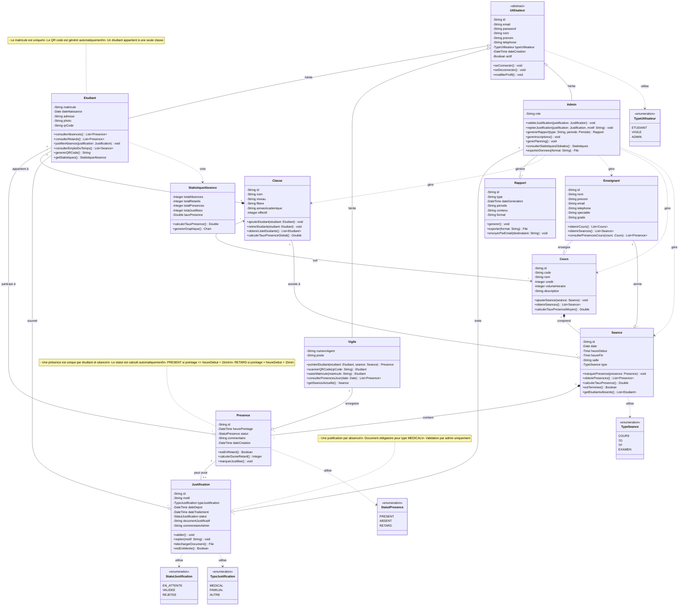

# Diagramme de Classes - Système de Gestion des Absences ISM

## Légende des Relations

- **`<|--`** : Héritage (extends)
- **`*--`** : Composition (l'objet possédé ne peut exister sans le possesseur)
- **`--o`** : Agrégation (l'objet possédé peut exister indépendamment)
- **`--`** : Association simple
- **`..>`** : Dépendance (uses)
- **`<-->`** : Association bidirectionnelle

## Cardinalités

- **`1`** : Un et un seul
- **`*`** : Zéro ou plusieurs
- **`0..1`** : Zéro ou un
- **`1..*`** : Un ou plusieurs

## Contraintes Métier Respectées

1. **Authentification** : Classe abstraite Utilisateur avec 3 types concrets
2. **Unicité** : Matricule étudiant et numéro agent vigile uniques
3. **Pointage** : Un seul pointage par étudiant et par séance
4. **Statut automatique** : PRESENT/RETARD calculé selon l'heure
5. **Justification** : Une seule par absence, validation par admin
6. **Hiérarchie** : Étudiant → Classe → Cours → Séances
7. **Traçabilité** : Dates de création et modification sur toutes les entités
