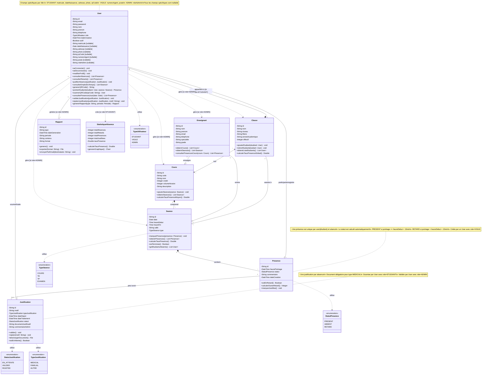

# Diagramme de Classes - Système de Gestion des Absences ISM

## Changements Effectués

### 1. **Entité User Unique**
- Plus d'héritage
- Un seul type `User` avec un attribut `role` (TypeUtilisateur)
- Tous les champs spécifiques sont **nullable** :
  - **Pour ETUDIANT** : matricule, dateNaissance, adresse, photo, qrCode
  - **Pour VIGILE** : numeroAgent, poste  
  - **Pour ADMIN** : roleAdmin

### 2. **Gestion par Rôle**
- Les méthodes sont disponibles sur User mais leur utilisation dépend du rôle
- Les relations conditionnelles sont annotées (ex: "si role=ETUDIANT")

### 3. **Avantages de cette Approche**
- Plus simple pour la base de données (une seule collection/table)
- Facilite la gestion des permissions
- Évite la complexité de l'héritage en MongoDB
- Permet facilement de changer de rôle si nécessaire

### 4. **Contraintes Maintenues**
- Unicité du matricule (pour les étudiants)
- Unicité du numeroAgent (pour les vigiles)
- Un étudiant appartient à une seule classe
- Les autres contraintes métier restent identiques
